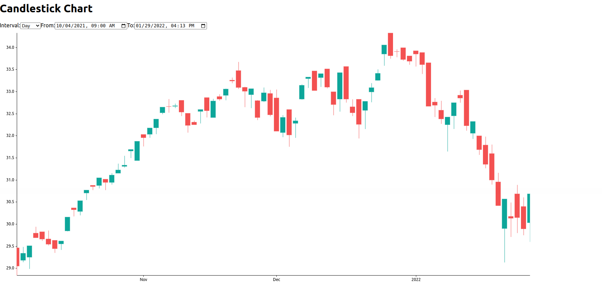

# React Task for creating Candlestick Chart

This project was bootstrapped with [Create React App](https://github.com/facebook/create-react-app).

## pre requests
- Node
- npm
- Text Editor or IDE
- make sure that ports 3000,3001 are Free

## How to make it work

- clone the repo
- run command `npm install`
- make the proxy work
    - go to directory proxy-server `cd proxy-server`
    - run command `node proxy.js` to up the proxy server implemented in Node
    - this Url suppose to be working after running the proxy http://localhost:3001/api/yahoo-finance?period1=1633381200&period2=1664917199&interval=1d&events=history&crumb=5YTX%2FgVGBmg
- make the react app work
    - run command `cd candlestick-chart-react-task`
    - run command `npm start` this will open this react page http://localhost:3000/ 

## Why we did what we did

### Issue number 1
the given api is block by CORS, this issue usually fixed by allowing the origin localhost to send requests 
but here we dont have any access to the backend behind the api
so the alter solution that was applicable and also to show some knowledge of NodeJs is creating Proxy server for calling the financial api without being blocked 
by CORS
```
 Access to fetch at 'https://query1.finance.yahoo.com/v7/finance/download/SPUS?period1=1633381200&period2=1664917199&interval=1d&events=history&crumb=5YTX%2FgVGBmg' from origin 'http://localhost:3000' has been blocked by CORS policy: No 'Access-Control-Allow-Origin' header is present on the requested resource. If an opaque response serves your needs, set the request's mode to 'no-cors' to fetch the resource with CORS disabled
```
you can realize from the code that we are not calling this api direct instead we call the proxy api
```
http://localhost:3001/api/yahoo-finance?period1=1633381200&period2=1664917199&interval=1d&events=history&crumb=5YTX%2FgVGBmg
```

### Issue number 2

#### what is the suitable chart library?

this is hard question because there are many libraries like
- Recharts
- Chart.js
- Highcharts
- Victory
- React Stockcharts

and much more libraries

but after looking for the popular ones i decided to choose `React Stockcharts`
http://rrag.github.io/react-stockcharts/documentation.html

because it is highly customizable stock charts and focuses mainly on Financial chart as you can see from the documentation link above

but while i was implementing it and searching more about it, i found even better libraries
actually it is Fork form the same library but  renamed, converted to typescript and bug fixes applied due to the original project being unmaintained
it's name is `react-financial-charts` from the name alone we can see it is giving much focus on Money Related charts and Financial stuff 

you can know more about the library and it's amazing charts you can visit

https://github.com/react-financial/react-financial-charts

https://react-financial.github.io/react-financial-charts/?path=/story/intro--page


of course i didnt implement all the existing features of the library in that task but from it's website you can see it's amazing features that will be definitely
great add for Fintech Company


